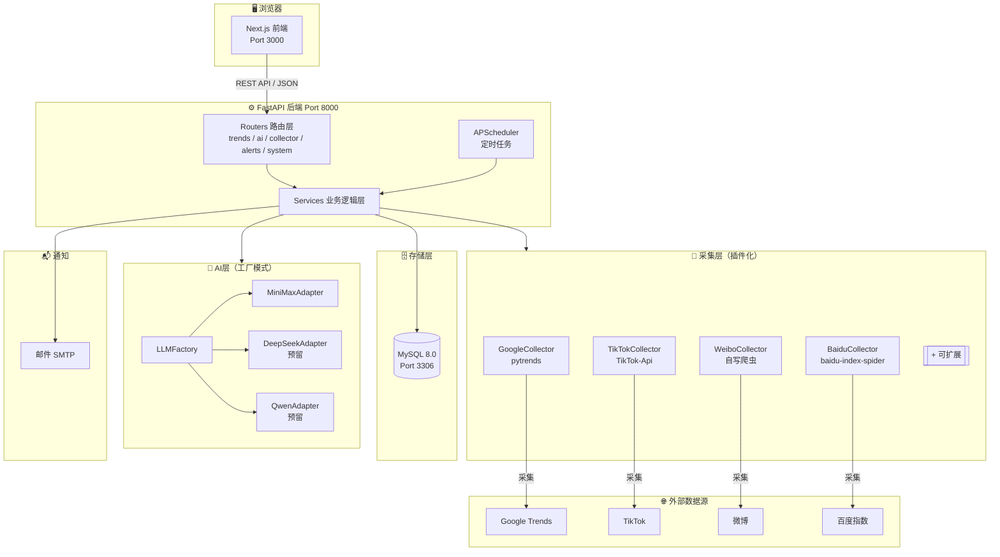
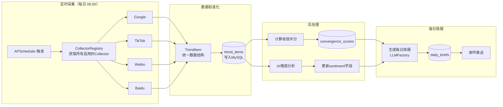
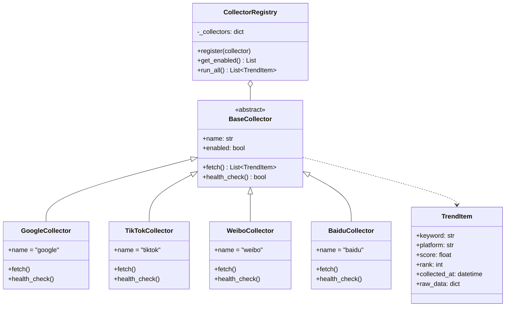
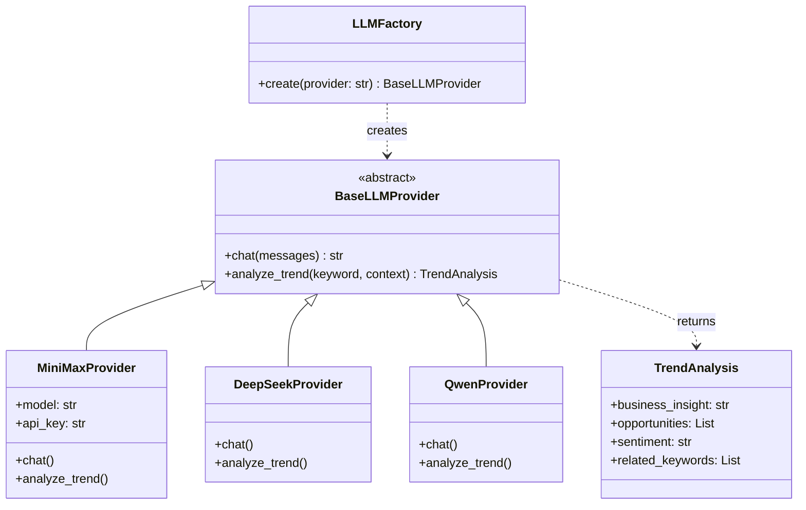
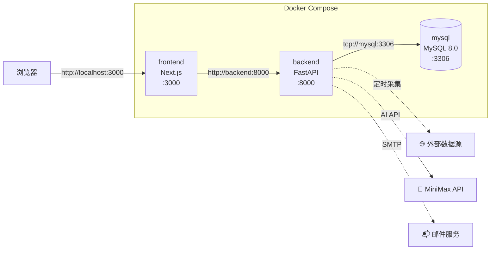
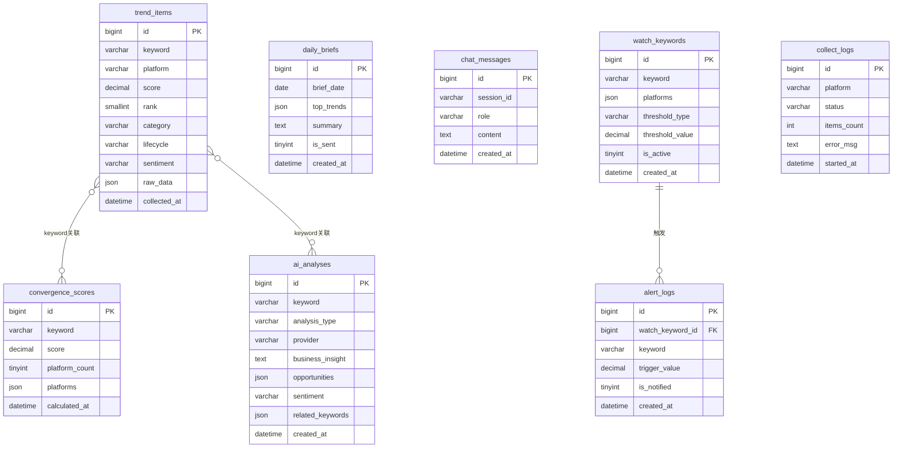

# 系统架构图
# TrendTracker — System Architecture

---

## 1. 整体系统架构

```mermaid
graph TB
    subgraph Client["🖥️ 浏览器"]
        UI[Next.js 前端<br/>Port 3000]
    end

    subgraph Backend["⚙️ FastAPI 后端 Port 8000"]
        direction TB
        Router[Routers 路由层<br/>trends / ai / collector / alerts / system]
        Service[Services 业务逻辑层]
        Scheduler[APScheduler<br/>定时任务]

        Router --> Service
        Scheduler --> Service
    end

    subgraph CollectorLayer["📡 采集层（插件化）"]
        direction LR
        GC[GoogleCollector<br/>pytrends]
        TC[TikTokCollector<br/>TikTok-Api]
        WC[WeiboCollector<br/>自写爬虫]
        BC[BaiduCollector<br/>baidu-index-spider]
        EXT[[ + 可扩展 ]]
    end

    subgraph AILayer["🤖 AI层（工厂模式）"]
        direction LR
        Factory[LLMFactory]
        MM[MiniMaxAdapter]
        DS[DeepSeekAdapter<br/>预留]
        QW[QwenAdapter<br/>预留]
        Factory --> MM
        Factory --> DS
        Factory --> QW
    end

    subgraph DataSources["🌐 外部数据源"]
        direction LR
        Google[Google Trends]
        TikTok[TikTok]
        Weibo[微博]
        Baidu[百度指数]
    end

    subgraph Storage["🗄️ 存储层"]
        MySQL[(MySQL 8.0<br/>Port 3306)]
    end

    subgraph Notify["📬 通知"]
        Email[邮件 SMTP]
    end

    UI -->|REST API / JSON| Router
    Service --> CollectorLayer
    Service --> AILayer
    Service --> MySQL
    Service --> Email

    GC -->|采集| Google
    TC -->|采集| TikTok
    WC -->|采集| Weibo
    BC -->|采集| Baidu
```

---

## 2. 数据流转图

```mermaid
flowchart LR
    subgraph Collect["定时采集（每日 06:00）"]
        A[APScheduler 触发] --> B[CollectorRegistry<br/>获取所有启用的Collector]
        B --> C1[Google]
        B --> C2[TikTok]
        B --> C3[Weibo]
        B --> C4[Baidu]
    end

    subgraph Normalize["数据标准化"]
        C1 & C2 & C3 & C4 --> D[TrendItem<br/>统一数据结构]
        D --> E[(trend_items<br/>写入MySQL)]
    end

    subgraph Process["后处理"]
        E --> F[计算收敛评分]
        F --> G[(convergence_scores)]
        E --> H[AI情感分析]
        H --> I[更新sentiment字段]
    end

    subgraph Brief["每日简报"]
        G & I --> J[生成每日简报<br/>LLMFactory]
        J --> K[(daily_briefs)]
        K --> L[邮件推送]
    end
```

---

## 3. 插件化采集层

```mermaid
classDiagram
    class BaseCollector {
        <<abstract>>
        +name: str
        +enabled: bool
        +fetch() List~TrendItem~
        +health_check() bool
    }

    class TrendItem {
        +keyword: str
        +platform: str
        +score: float
        +rank: int
        +collected_at: datetime
        +raw_data: dict
    }

    class CollectorRegistry {
        -_collectors: dict
        +register(collector)
        +get_enabled() List
        +run_all() List~TrendItem~
    }

    class GoogleCollector {
        +name = "google"
        +fetch()
        +health_check()
    }

    class TikTokCollector {
        +name = "tiktok"
        +fetch()
        +health_check()
    }

    class WeiboCollector {
        +name = "weibo"
        +fetch()
        +health_check()
    }

    class BaiduCollector {
        +name = "baidu"
        +fetch()
        +health_check()
    }

    BaseCollector <|-- GoogleCollector
    BaseCollector <|-- TikTokCollector
    BaseCollector <|-- WeiboCollector
    BaseCollector <|-- BaiduCollector
    BaseCollector ..> TrendItem
    CollectorRegistry o-- BaseCollector
```

---

## 4. AI 多模型工厂

```mermaid
classDiagram
    class BaseLLMProvider {
        <<abstract>>
        +chat(messages) str
        +analyze_trend(keyword, context) TrendAnalysis
    }

    class LLMFactory {
        +create(provider: str) BaseLLMProvider
    }

    class MiniMaxProvider {
        +model: str
        +api_key: str
        +chat()
        +analyze_trend()
    }

    class DeepSeekProvider {
        +chat()
        +analyze_trend()
    }

    class QwenProvider {
        +chat()
        +analyze_trend()
    }

    class TrendAnalysis {
        +business_insight: str
        +opportunities: List
        +sentiment: str
        +related_keywords: List
    }

    BaseLLMProvider <|-- MiniMaxProvider
    BaseLLMProvider <|-- DeepSeekProvider
    BaseLLMProvider <|-- QwenProvider
    LLMFactory ..> BaseLLMProvider : creates
    BaseLLMProvider ..> TrendAnalysis : returns
```

---

## 5. Docker Compose 服务关系

```mermaid
graph LR
    subgraph compose["Docker Compose"]
        FE[frontend<br/>Next.js<br/>:3000]
        BE[backend<br/>FastAPI<br/>:8000]
        DB[(mysql<br/>MySQL 8.0<br/>:3306)]
    end

    Browser[浏览器] -->|http://localhost:3000| FE
    FE -->|http://backend:8000| BE
    BE -->|tcp://mysql:3306| DB

    BE -.->|定时采集| Internet[🌐 外部数据源]
    BE -.->|AI API| LLMAPI[🤖 MiniMax API]
    BE -.->|SMTP| EmailSrv[📬 邮件服务]
```

---

## 6. 数据库 ER 图

```mermaid
erDiagram
    trend_items {
        bigint id PK
        varchar keyword
        varchar platform
        decimal score
        smallint rank
        varchar category
        varchar lifecycle
        varchar sentiment
        json raw_data
        datetime collected_at
    }

    convergence_scores {
        bigint id PK
        varchar keyword
        decimal score
        tinyint platform_count
        json platforms
        datetime calculated_at
    }

    ai_analyses {
        bigint id PK
        varchar keyword
        varchar analysis_type
        varchar provider
        text business_insight
        json opportunities
        varchar sentiment
        json related_keywords
        datetime created_at
    }

    daily_briefs {
        bigint id PK
        date brief_date
        json top_trends
        text summary
        tinyint is_sent
        datetime created_at
    }

    chat_messages {
        bigint id PK
        varchar session_id
        varchar role
        text content
        datetime created_at
    }

    watch_keywords {
        bigint id PK
        varchar keyword
        json platforms
        varchar threshold_type
        decimal threshold_value
        tinyint is_active
        datetime created_at
    }

    alert_logs {
        bigint id PK
        bigint watch_keyword_id FK
        varchar keyword
        decimal trigger_value
        tinyint is_notified
        datetime created_at
    }

    collect_logs {
        bigint id PK
        varchar platform
        varchar status
        int items_count
        text error_msg
        datetime started_at
    }

    watch_keywords ||--o{ alert_logs : "触发"
    trend_items }o--o{ convergence_scores : "keyword关联"
    trend_items }o--o{ ai_analyses : "keyword关联"
```
