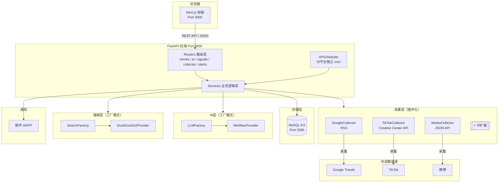
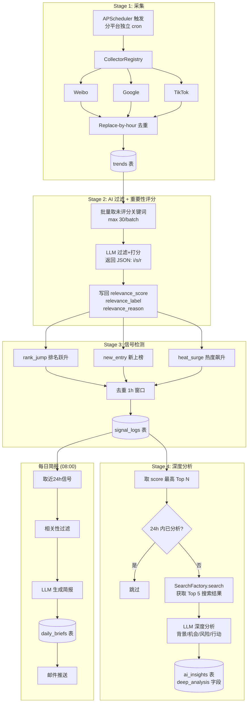
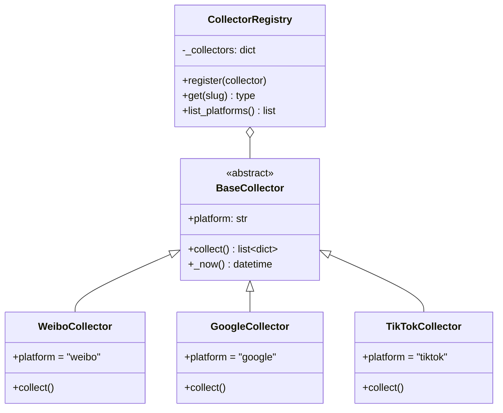
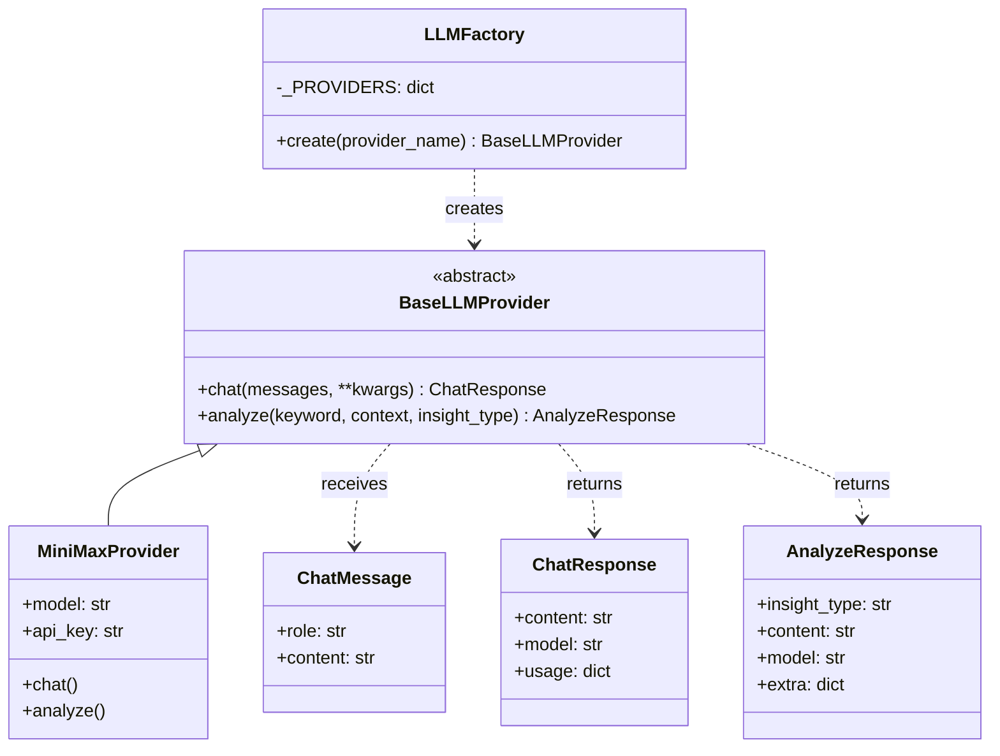
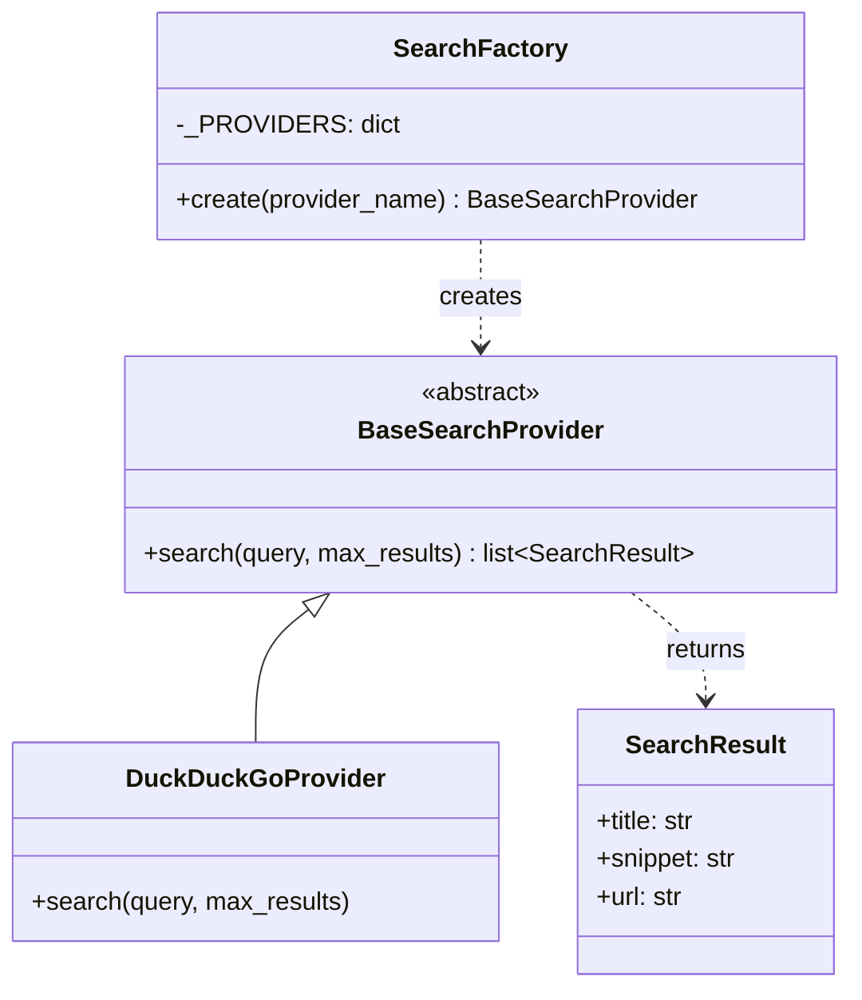
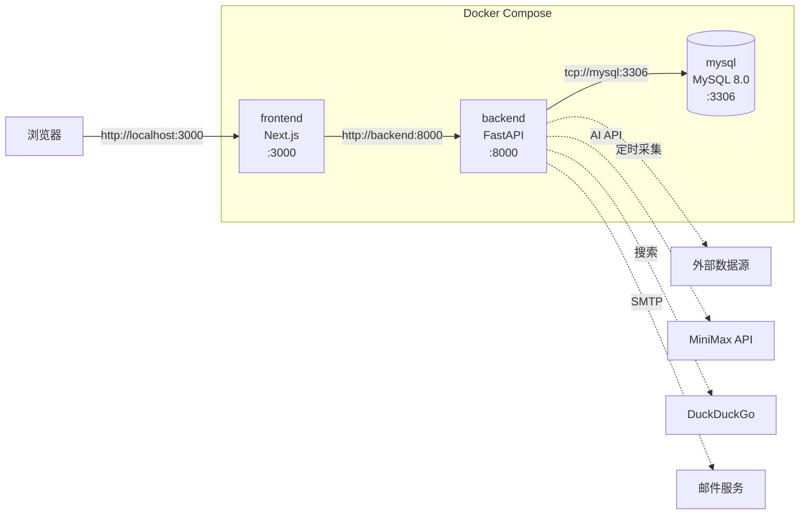
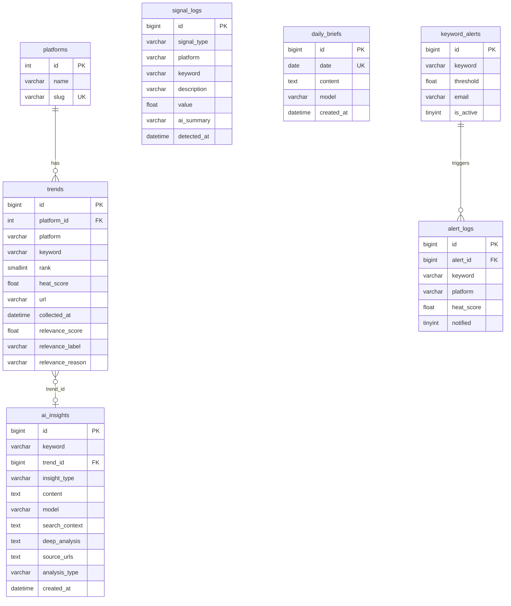

# 系统架构图
# TrendTracker — System Architecture

**最后更新**: 2026-03-22

---

## 1. 整体系统架构

---

## 2. AI 智能管线数据流

---

## 3. 插件化采集层

---

## 4. AI 多模型工厂

---

## 5. 搜索层工厂

---

## 6. Docker Compose 服务关系

---

## 7. 数据库 ER 图

